# Import libraries


```python
from stat_sum_func import ToParquet, DatasetStatistics
```

# CSV/TSV to Parquet conversion


```python
base_dir = "raw"
converter = ToParquet(base_dir)
converter.main() 
```

    No data file found for sulfur_2
    ============================================================
    ============================================================
    No data file found for delays_zurich_transport
    ============================================================
    No data file found for MiamiHousing2016
    ============================================================
    No data file found for keggdirected
    ============================================================
    No data file found for bike
    ============================================================
    No data file found for protein
    ============================================================
    No data file found for 218_house_8L
    ============================================================
    No data file found for nyc_taxi_green_dec_2016
    ============================================================
    No data file found for CBM_2
    ============================================================
    No data file found for diamonds
    ============================================================
    No data file found for books
    ============================================================
    No data file found for kin40k
    ============================================================
    No data file found for gas_turbine_co_and_nox_emission
    ============================================================
    No data file found for elevators
    ============================================================
    No data file found for sulfur_1
    ============================================================
    No data file found for house_sales
    ============================================================
    No data file found for 3droad
    ============================================================
    No data file found for tamielectric
    ============================================================
    No data file found for medical_charges
    ============================================================
    No data file found for house
    ============================================================
    No data file found for power_consumption
    ============================================================
    No data file found for CASP
    ============================================================
    No data file found for taxi
    ============================================================
    No data file found for CBM_1
    ============================================================
    No data file found for california
    ============================================================
    No data file found for players_22
    ============================================================
    Loaded data from 0 folders.
    Encountered errors in 26 folders:
    sulfur_2
    delays_zurich_transport
    MiamiHousing2016
    keggdirected
    bike
    protein
    218_house_8L
    nyc_taxi_green_dec_2016
    CBM_2
    diamonds
    books
    kin40k
    gas_turbine_co_and_nox_emission
    elevators
    sulfur_1
    house_sales
    3droad
    tamielectric
    medical_charges
    house
    power_consumption
    CASP
    taxi
    CBM_1
    california
    players_22


# Raw data statistics summary


```python
file = "power_consumption"
path = f"raw/{file}/{file}.parquet"
statistics_man = DatasetStatistics(path)
statistics_man.df
```


<div>
<table border="1" class="dataframe">
  <thead>
    <tr style="text-align: right;">
      <th></th>
      <th>draft_aft_telegram</th>
      <th>draft_fore_telegram</th>
      <th>stw</th>
      <th>diff_speed_overground</th>
      <th>awind_vcomp_provider</th>
      <th>awind_ucomp_provider</th>
      <th>rcurrent_vcomp</th>
      <th>rcurrent_ucomp</th>
      <th>comb_wind_swell_wave_height</th>
      <th>power</th>
    </tr>
  </thead>
  <tbody>
    <tr>
      <th>0</th>
      <td>13.85</td>
      <td>13.85</td>
      <td>18.672400</td>
      <td>0.00</td>
      <td>15.165224</td>
      <td>0.410578</td>
      <td>0.082693</td>
      <td>0.346217</td>
      <td>0.113021</td>
      <td>23058.0</td>
    </tr>
    <tr>
      <th>1</th>
      <td>10.00</td>
      <td>9.87</td>
      <td>19.226700</td>
      <td>0.00</td>
      <td>12.211791</td>
      <td>15.816707</td>
      <td>-0.323882</td>
      <td>-0.113008</td>
      <td>2.037000</td>
      <td>23197.0</td>
    </tr>
    <tr>
      <th>2</th>
      <td>12.00</td>
      <td>11.49</td>
      <td>18.395100</td>
      <td>0.00</td>
      <td>21.005612</td>
      <td>18.225887</td>
      <td>-0.107005</td>
      <td>-0.455295</td>
      <td>1.771780</td>
      <td>23579.0</td>
    </tr>
    <tr>
      <th>3</th>
      <td>11.84</td>
      <td>11.85</td>
      <td>17.891701</td>
      <td>0.00</td>
      <td>27.230972</td>
      <td>13.020768</td>
      <td>0.383015</td>
      <td>0.293125</td>
      <td>2.420000</td>
      <td>22321.0</td>
    </tr>
    <tr>
      <th>4</th>
      <td>14.70</td>
      <td>14.70</td>
      <td>19.870001</td>
      <td>0.00</td>
      <td>21.643135</td>
      <td>0.950529</td>
      <td>-0.066324</td>
      <td>-0.125265</td>
      <td>0.700087</td>
      <td>32374.0</td>
    </tr>
    <tr>
      <th>...</th>
      <td>...</td>
      <td>...</td>
      <td>...</td>
      <td>...</td>
      <td>...</td>
      <td>...</td>
      <td>...</td>
      <td>...</td>
      <td>...</td>
      <td>...</td>
    </tr>
    <tr>
      <th>567437</th>
      <td>10.20</td>
      <td>10.20</td>
      <td>13.991900</td>
      <td>0.00</td>
      <td>13.282523</td>
      <td>3.337768</td>
      <td>0.346829</td>
      <td>0.040045</td>
      <td>0.117188</td>
      <td>8778.0</td>
    </tr>
    <tr>
      <th>567438</th>
      <td>13.49</td>
      <td>13.49</td>
      <td>18.603100</td>
      <td>0.00</td>
      <td>24.097143</td>
      <td>3.013288</td>
      <td>-0.407819</td>
      <td>-1.108418</td>
      <td>1.814170</td>
      <td>26307.0</td>
    </tr>
    <tr>
      <th>567439</th>
      <td>12.90</td>
      <td>12.90</td>
      <td>12.417100</td>
      <td>-0.20</td>
      <td>21.074365</td>
      <td>7.399422</td>
      <td>0.508167</td>
      <td>-0.279030</td>
      <td>0.579667</td>
      <td>7594.0</td>
    </tr>
    <tr>
      <th>567440</th>
      <td>13.10</td>
      <td>12.70</td>
      <td>8.161400</td>
      <td>1.70</td>
      <td>9.978826</td>
      <td>2.931367</td>
      <td>0.767617</td>
      <td>0.029912</td>
      <td>0.023438</td>
      <td>7366.0</td>
    </tr>
    <tr>
      <th>567441</th>
      <td>12.60</td>
      <td>12.50</td>
      <td>8.450300</td>
      <td>1.12</td>
      <td>3.212103</td>
      <td>1.086232</td>
      <td>0.032664</td>
      <td>0.030289</td>
      <td>0.890222</td>
      <td>6703.0</td>
    </tr>
  </tbody>
</table>
<p>567442 rows × 10 columns</p>
</div>


```python
for feature in statistics_man.df.columns:
    statistics_man.plot_distribution(feature)
```


    
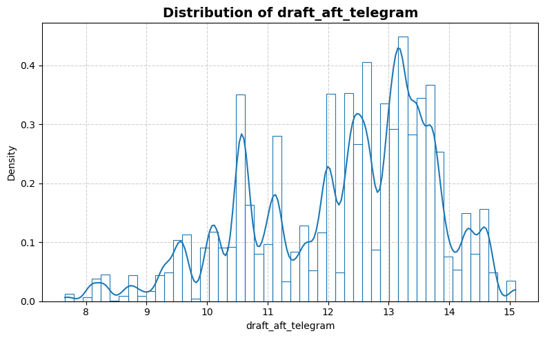
    


    
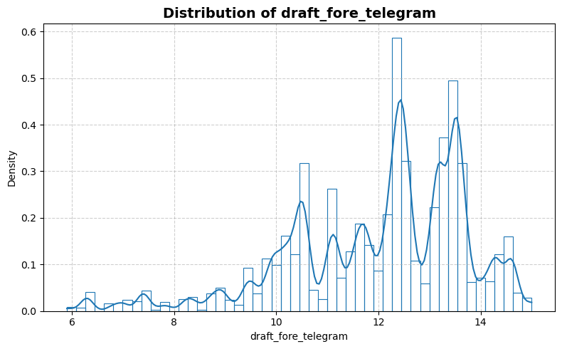
    


    
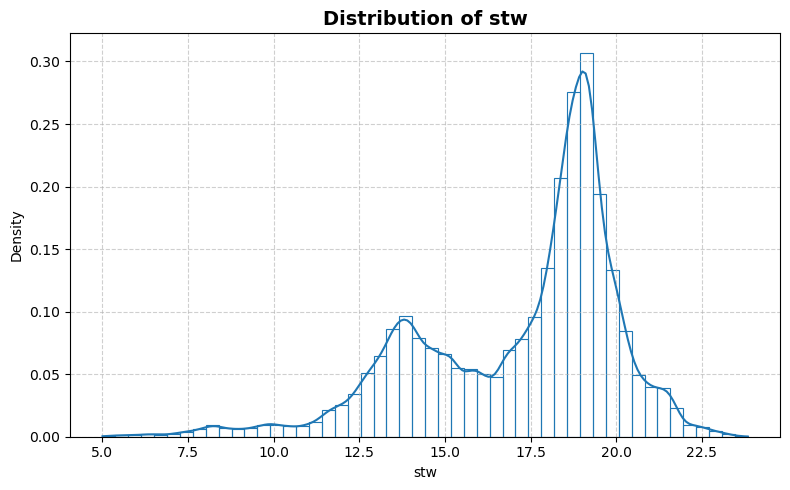
    


    
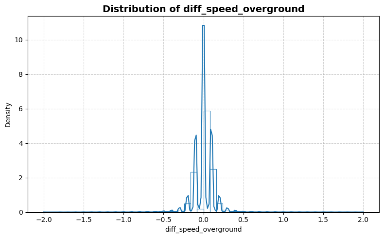
    


    
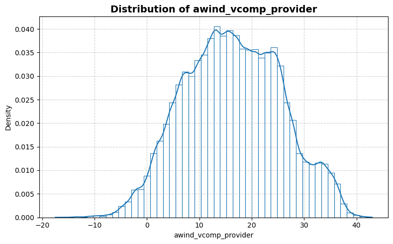
    


    
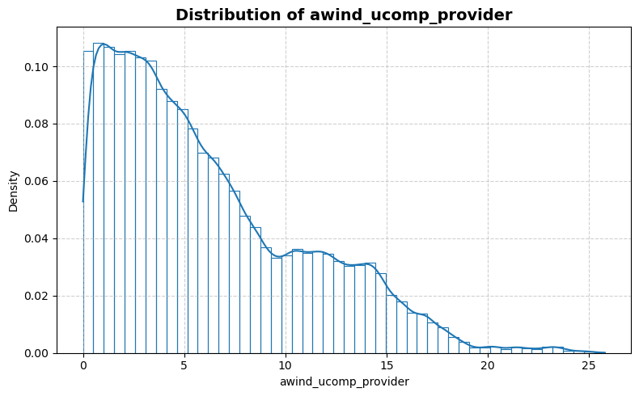
    


    
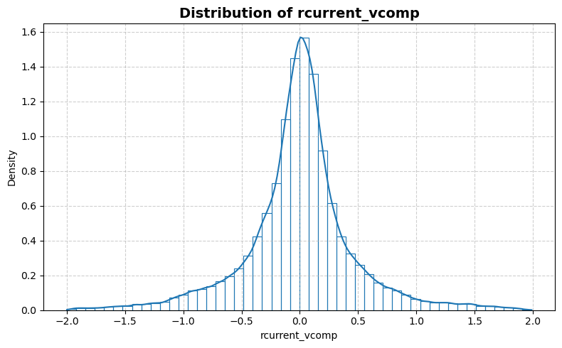
    


    
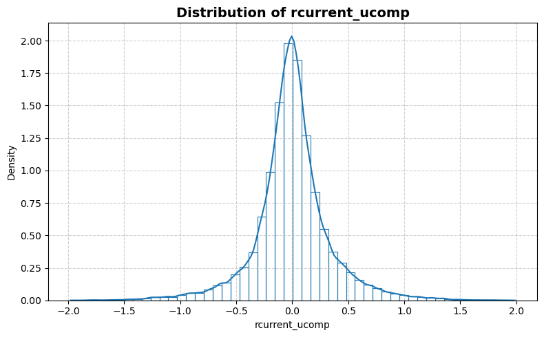
    


    
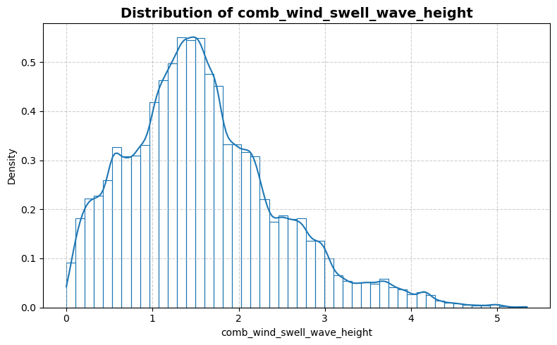
    


    
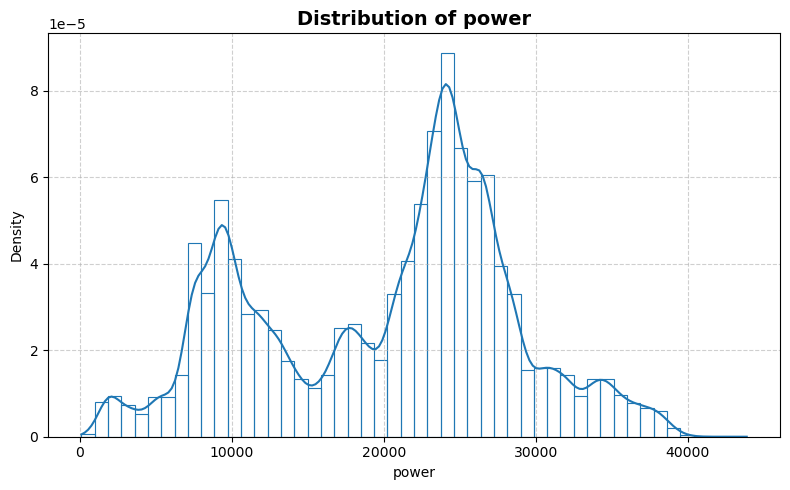
    


```python
statistics_man.plot_box()
```


    
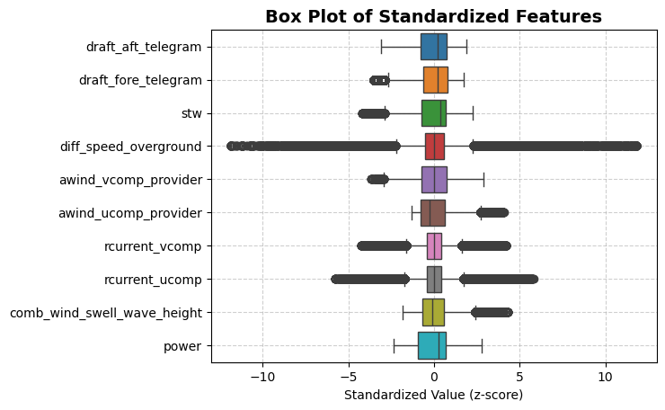
    


```python
statistics_man.print_stat_sum()
```

    Number of samples : 567442
    Number of features: 9
    ==============================


<div>
<table border="1" class="dataframe">
  <thead>
    <tr style="text-align: right;">
      <th></th>
      <th>dtype</th>
      <th>missing</th>
      <th>count</th>
      <th>median</th>
      <th>mean</th>
      <th>std</th>
      <th>min</th>
      <th>25%</th>
      <th>50%</th>
      <th>75%</th>
      <th>max</th>
    </tr>
  </thead>
  <tbody>
    <tr>
      <th>draft_aft_telegram</th>
      <td>float64</td>
      <td>0</td>
      <td>567442.0</td>
      <td>12.590000</td>
      <td>12.269468</td>
      <td>1.502990</td>
      <td>7.650000</td>
      <td>11.100000</td>
      <td>12.590000</td>
      <td>13.400000</td>
      <td>15.100000</td>
    </tr>
    <tr>
      <th>draft_fore_telegram</th>
      <td>float64</td>
      <td>0</td>
      <td>567442.0</td>
      <td>12.400000</td>
      <td>12.008729</td>
      <td>1.729265</td>
      <td>5.900000</td>
      <td>10.900000</td>
      <td>12.400000</td>
      <td>13.350000</td>
      <td>15.000000</td>
    </tr>
    <tr>
      <th>stw</th>
      <td>float64</td>
      <td>0</td>
      <td>567442.0</td>
      <td>18.293699</td>
      <td>17.210161</td>
      <td>2.924155</td>
      <td>5.003200</td>
      <td>15.021300</td>
      <td>18.293699</td>
      <td>19.221600</td>
      <td>23.840300</td>
    </tr>
    <tr>
      <th>diff_speed_overground</th>
      <td>float64</td>
      <td>0</td>
      <td>567442.0</td>
      <td>0.000000</td>
      <td>0.000557</td>
      <td>0.169165</td>
      <td>-2.000000</td>
      <td>-0.090000</td>
      <td>0.000000</td>
      <td>0.100000</td>
      <td>2.000000</td>
    </tr>
    <tr>
      <th>awind_vcomp_provider</th>
      <td>float64</td>
      <td>0</td>
      <td>567442.0</td>
      <td>16.240061</td>
      <td>16.423514</td>
      <td>9.208890</td>
      <td>-17.522674</td>
      <td>9.643000</td>
      <td>16.240061</td>
      <td>23.197122</td>
      <td>42.996571</td>
    </tr>
    <tr>
      <th>awind_ucomp_provider</th>
      <td>float64</td>
      <td>0</td>
      <td>567442.0</td>
      <td>4.969068</td>
      <td>6.193491</td>
      <td>4.807771</td>
      <td>0.000051</td>
      <td>2.351523</td>
      <td>4.969068</td>
      <td>9.131529</td>
      <td>25.788892</td>
    </tr>
    <tr>
      <th>rcurrent_vcomp</th>
      <td>float64</td>
      <td>0</td>
      <td>567442.0</td>
      <td>0.009777</td>
      <td>0.000661</td>
      <td>0.471725</td>
      <td>-1.999337</td>
      <td>-0.192518</td>
      <td>0.009777</td>
      <td>0.195759</td>
      <td>1.990206</td>
    </tr>
    <tr>
      <th>rcurrent_ucomp</th>
      <td>float64</td>
      <td>0</td>
      <td>567442.0</td>
      <td>-0.005303</td>
      <td>0.000422</td>
      <td>0.341720</td>
      <td>-1.977741</td>
      <td>-0.149388</td>
      <td>-0.005303</td>
      <td>0.146225</td>
      <td>1.987223</td>
    </tr>
    <tr>
      <th>comb_wind_swell_wave_height</th>
      <td>float64</td>
      <td>0</td>
      <td>567442.0</td>
      <td>1.486980</td>
      <td>1.587313</td>
      <td>0.875894</td>
      <td>0.000221</td>
      <td>0.987222</td>
      <td>1.486980</td>
      <td>2.079340</td>
      <td>5.344530</td>
    </tr>
    <tr>
      <th>power</th>
      <td>float64</td>
      <td>0</td>
      <td>567442.0</td>
      <td>22570.000000</td>
      <td>20171.242149</td>
      <td>8476.921696</td>
      <td>103.000000</td>
      <td>12058.000000</td>
      <td>22570.000000</td>
      <td>26097.000000</td>
      <td>43883.000000</td>
    </tr>
  </tbody>
</table>
</div>


```python
statistics_man.plot_corr_heatmap()
```


    
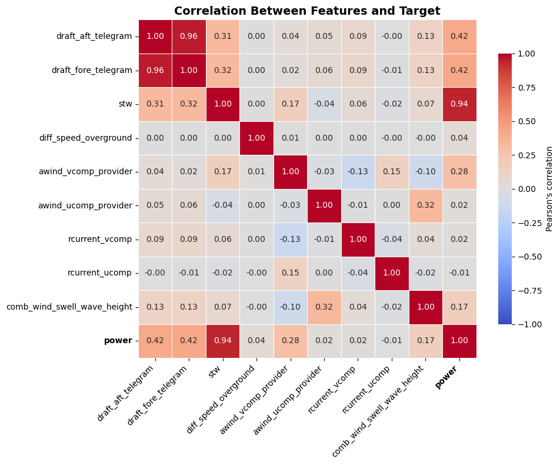
    


```python

```
